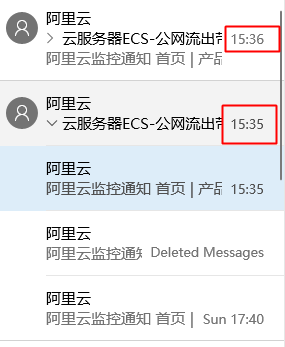
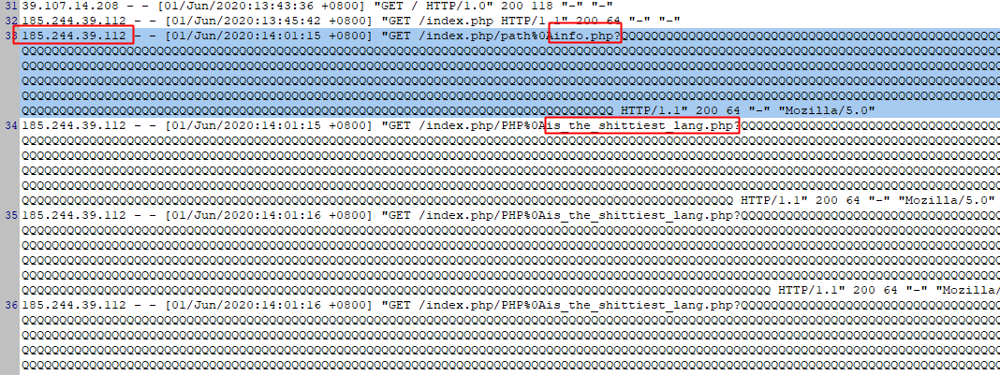

## host.deny

最近一直发现服务器被攻击，流量总是在下午指定时间超标。反馈aliyun后，得到的答案是服务器正常，我的带宽小，建议我升级带宽。。。

要么升级带宽，要么购买云盾。但我希望自己解决这个问题：




通过 web 日志可以发现，有一些ip不断发送攻击的 POST 请求，经查发现这些 ip 也被其他用户记录过。考虑到大部分ip都是国外的。所以简单的方法就是 屏蔽这些ip就好了。



当然，屏蔽ip是最下下策，因为你必须不断更新ip，为此成了这个项目，维护最新黑名单ip。

## 黑名单ip表

[黑名单ip表](docs/all_host.md)

## 更新黑名单

```
python cmd/refresh.py
```